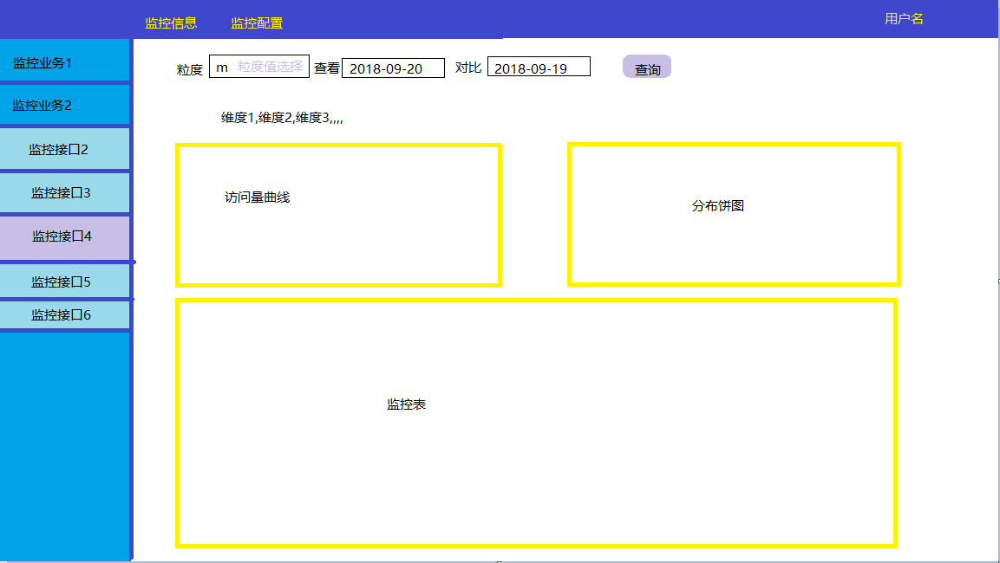

[TOC]

# 业务监控告警平台

<!-- 考虑点 -->

<!--  -->

## 业务描述

多数中小型公司没有能力自研并维护业务监控告警平台,本产品作为toB产品面向企业,为企业业务提供监控告警能力.

- 监控示例

  

## 平台侧开发

### 后端

> mysql,python,C++

##### db设计

- 表结构
- 基本信息表
  - 商户基本信息
- 监控库表
  - 按月分库按天分表
- 用户库
  - 按商户分表

##### *容灾

- 双机热备

- *扩容策略

##### 安全性

##### 用户级别 [开发,运维,产品]

##### 监控

- 维度 (业务成功量,请求量,失败量,错误码)
  - 接口
- 粒度
  - 秒级
  - 分钟级
  - 天
- 邮件
  - 监控信息邮件

##### 上报接口 

- 加密
- appkey

##### 告警

- 电话
- 邮件
- 短信

### 前端

> javascript,html,css

##### 可视化

- 监控
  - 曲线
  - 饼图
  - 柱形图

##### web

- pc浏览器
- 平板浏览器
- 移动端浏览器

##### *app

- Android

##### *微信公众/订阅号

## 商户侧开发

平台侧需提供联调环境供甲方进行开发测试工作

---

最终展示需要:

- 商户测访问程序
- 用户数据(随机模拟)